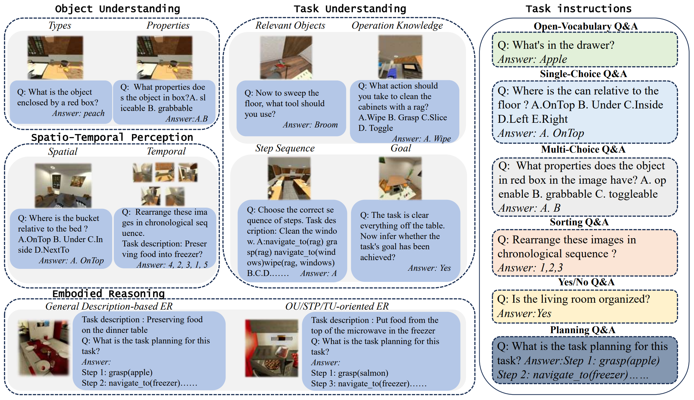

# MFE-ETP
<a name="readme-top"></a>

<p align="left">
    <a href='https://arxiv.org/abs/2407.05047'>
      
    </a>
    <a href='https://arxiv.org/pdf/2407.05047'>
      
    </a>
    <a href='https://mfe-etp.github.io/'>
      
    </a>
</p>

for the new data, please refer to the Google Drive link: [New Data](https://drive.google.com/drive/folders/1jxiVVzJn87Of6OJ_h0dVUQN1bbjYXy0c?usp=drive_link)

This repo contains benchmark data and code for our NeurIPS Datasets and Benchmarks 2024 paper:

[MFE-ETP: A Comprehensive Evaluation Benchmark for Multi-modal Foundation Models on Embodied Task Planning](https://mfe-etp.github.io/)

<!--[Baoxiong Jia](https://buzz-beater.github.io/), [Ting Lei](https://scholar.google.com/citations?user=Zk7Vxz0AAAAJ&hl=en), [Song-Chun Zhu](http://www.stat.ucla.edu/~sczhu/), [Siyuan Huang](https://siyuanhuang.com/)-->



<details>
  <summary>Table of Contents</summary>
  <ol>
    <li>
      <a href="#getting-started">Getting Started</a>
      <ul>
        <li><a href="#installation">installation</a></li>
        <li><a href="#inference">inference</a></li>
        <li><a href="#evaluation">evaluation</a></li>
      </ul>
    </li>
    <li><a href="#contributing">Contributing</a></li>
    <li><a href="#license">License</a></li>
    <li><a href="#contact">Contact</a></li>
  </ol>
</details>

## File Structure and Usage
<details>
  <summary>File Structure and Usage</summary>
  <ol>
    <li>
      <a>data: benchmark data classified by capability aspect</a>
    </li>
    <li>
      <a>scrpts</a>
      <ul>
        <li><a>chat_gpt_api.py: encapsulating ChatGPT inference</a></li>
        <li><a>dataset_predict_blip.py: inference script for BLIP-2 and InstructBLIP</a></li>
        <li><a>dataset_predict_gpt4v.py: inference script for ChatGPT(-4V)</a></li>
        <li><a>dataset_predict_llava.py: inference script for llava</a></li>
        <li><a>dataset_predict_minicpm.py: inference script for minicpm</a></li>
        <li><a>dataset_predict_minigpt4.py: inference script for minigpt4</a></li>
        <li><a>evaluate_gpt3.5_mp: using GPT-3.5 to evaluate prediction results with multithreading</a></li>
        <li><a>minigpt4_eval.yaml.py: configuration file for Minigpt4</a></li>
        <li><a>openai_cfg.json: configuration file for OpenAI api</a></li>
        <li><a>task_planning.py: Embodied Reasoning with GPT-4V</a></li>
      </ul>
    </li>
    <li><a>LICENSE: license file</a></li>
    <li><a>README.md</a></li>
  </ol>
</details>

## Getting Started
        
### installation

1. Build environment

   We recommend building a standalone Conda environment for the model you want to use. For example if you want to use BLIP-2:

  ```sh
  conda create -n BLIP-2 python=3.10
  conda activate BLIP-2
  pip install -r requirement.txt
  ```

   The requirement file of BLIP-2 is at [https://github.com/salesforce/LAVIS/blob/main/requirements.txt](https://github.com/salesforce/LAVIS/blob/main/requirements.txt)

2. Clone the repo

   ```sh
   git clone https://github.com/TJURLLAB-EAI/MFE-ETP
   cd MFE-ETP
   ```

### inference

1. Run prediction script

   ```sh
   python dataset_predict_blip.py --model blip2flant5xl --output-root "./benchmark-evaluation" --device'"cuda:0"
   ```

### evaluation

1. Run evaluation script

   ```sh
   python evaluation_gpt3.5_mp.py
   ```

<p align="right">(<a href="#readme-top">back to top</a>)</p>

## Contributing

If you have a suggestion that would make this better, please fork the repo and create a pull request. You can also simply open an issue with the tag "enhancement".
Don't forget to give the project a star! Thanks again!

1. Fork the Project
2. Create your Feature Branch (`git checkout -b feature/AmazingFeature`)
3. Commit your Changes (`git commit -m 'Add some AmazingFeature'`)
4. Push to the Branch (`git push origin feature/AmazingFeature`)
5. Open a Pull Request

<p align="right">(<a href="#readme-top">back to top</a>)</p>


## LICENSE
Our MFE-ETP benchmark is released under the MIT license. See the "LICENSE" file for additional details.

<p align="right">(<a href="#readme-top">back to top</a>)</p>

## Contact

Xian Fu - xianfu@tju.edu.cn

Min Zhang - min_zhang@tju.edu.cn

<p align="right">(<a href="#readme-top">back to top</a>)</p>


